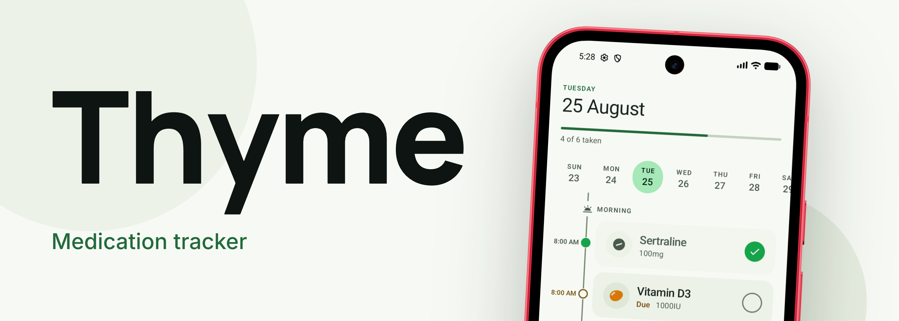

<p align="center">
  
</p>

# Thyme

*yes it has no icon yet :(*

> [!WARNING]
> Thyme is a work in progress. Things may change or break !!!

## Install

<a href="https://apps.obtainium.imranr.dev/redirect?r=obtainium://app/%7B%22id%22:%22dev.whayn.thyme%22%2C%22url%22:%22https://github.com/whayn/thyme%22%2C%22author%22:%22whayn%22%2C%22name%22:%22Thyme%22%2C%22preferredApkIndex%22:0%2C%22additionalSettings%22:%22%7B%5C%22includePrereleases%5C%22:false%2C%5C%22fallbackToOlderReleases%5C%22:true%2C%5C%22filterReleaseTitlesByRegEx%5C%22:%5C%22%5C%22%2C%5C%22filterReleaseNotesByRegEx%5C%22:%5C%22%5C%22%2C%5C%22verifyLatestTag%5C%22:false%2C%5C%22sortMethodChoice%5C%22:%5C%22date%5C%22%2C%5C%22useLatestAssetDateAsReleaseDate%5C%22:false%2C%5C%22releaseTitleAsVersion%5C%22:false%2C%5C%22trackOnly%5C%22:false%2C%5C%22versionExtractionRegEx%5C%22:%5C%22%5C%22%2C%5C%22matchGroupToUse%5C%22:%5C%22%5C%22%2C%5C%22versionDetection%5C%22:true%2C%5C%22releaseDateAsVersion%5C%22:false%2C%5C%22useVersionCodeAsOSVersion%5C%22:false%2C%5C%22apkFilterRegEx%5C%22:%5C%22%5C%22%2C%5C%22invertAPKFilter%5C%22:false%2C%5C%22autoApkFilterByArch%5C%22:true%2C%5C%22appName%5C%22:%5C%22%5C%22%2C%5C%22appAuthor%5C%22:%5C%22%5C%22%2C%5C%22shizukuPretendToBeGooglePlay%5C%22:false%2C%5C%22allowInsecure%5C%22:false%2C%5C%22exemptFromBackgroundUpdates%5C%22:false%2C%5C%22skipUpdateNotifications%5C%22:false%2C%5C%22about%5C%22:%5C%22%5C%22%2C%5C%22refreshBeforeDownload%5C%22:false%2C%5C%22includeZips%5C%22:false%2C%5C%22zippedApkFilterRegEx%5C%22:%5C%22%5C%22%7D%22%2C%22overrideSource%22:null%7D">
  
</a>

Or get the latest APK in the [Releases](https://github.com/whayn/thyme/releases) page.

## Features

- **Daily View** : today's doses, clickable to log ! All separated into day periods
- **4 different schedule types** : chosen weekdays, every N days, on/off cycles (ie. 21-on/7-off)
  and multiple courses per medication
- **Weird day stuff** : the day rollover is at 5, so a 02:00 dose shows up as tonight's, idk it made
  more sense for me
- **Cool stats !** : tells you your adherence for given period, and you get a calendar overview
- **I think it looks good** : Material 3, light and dark mode
- **All local and private** your data is stored locally and cannot leave the device !

## Build

You'll need [Android Studio](https://developer.android.com/studio) (or a JDK 21 + Android SDK setup)
and Git.

```bash
git clone https://github.com/whayn/thyme.git
cd thyme
./gradlew installDebug 
```

Other useful stuff:

```bash
./gradlew test
./gradlew lint  
```

Tip: if Gradle claims everything is up to date after an edit, add `--rerun-tasks`

Minimum supported Android version is 8.0 (API 26)

## Roadmap

- [ ] An app icon
- [ ] Dose reminders *(in development,
  on [`feature/alerts`](https://github.com/whayn/thyme/tree/feature/alerts))*
- [ ] Data export and backup !

## License

[GPL-2.0](LICENSE)