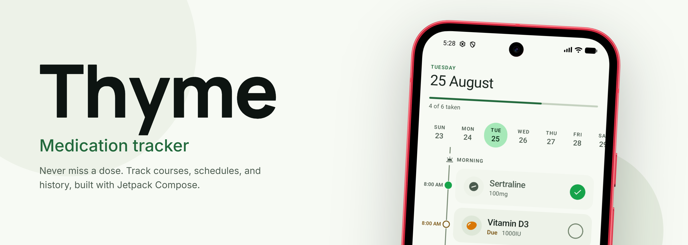

  

# Thyme

> [!WARNING]
> Thyme is a work in progress. Things may change or break !!!

## Install

Or grab the latest APK directly from the [Releases](https://github.com/whayn/thyme/releases) page.
